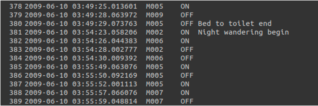

## Deeplearning-in-IoT-systems

### _Master's Project @University of British Columbia_

---

### Objective of Project:

- **Analysis**: Evaluation of the current state of the art of IoT architecture and Deep Learning systems followed by an
  analysis of the use of Deep Learning and IoT technologies in union to improve existing IoT architecture
- **Implementation**: Demonstration of the proposed idea by applying sequence analysis using RNN’s on temporal
  time series sensor data to perform human activity recognition to assist smart home system to adapt to the dynamic
  environment and deal with noise better

---

### Dataset:

[CASAS Dataset] http://casas.wsu.edu/datasets/

---

### Data Preprocessing

**DATA**

**PREPROCESSING STEPS**

- Categorize activities to more defined activites
- Collect readings (sensor, value, activity) into a list,
- map Categorized activites to the activities list and them numericalize them (encode).
- tokenize and numericalize sensor activations (sensor + value)
- map activities to sequences of sensor activations that caused the activity
- pad sequences to same length

_INFO: The sensor events are generated from motion sensors (these sensor IDs begin with "M") and
temperature sensors (these sensor IDs begin with "T")._

**GROUPING OF SIMILAR ACTIVITIES**

Activity mapping based on common sensor activations:

| Activity          |      Group |
| :---------------- | ---------: |
| Breakfast         |        Eat |
| Bed to toilet     | Use Toilet |
| R1 sleep          |      Sleep |
| R1 wake           |    Wake up |
| R1 work in office |       Work |
| Dinner            |        Eat |
| Laundry           |    Laundry |
| Leave home        |       Exit |
| Lunch             |        Eat |
| Night wandering   |     Others |
| R2 sleep          |      Sleep |
| R2 take medicine  |    Counter |
| R2 wake           |    Wake up |

---

### How to read the experiment notebooks: 
- A description of the model architecture and choice of hyperparameters are given at the top of the notebook
- [SKIP] This is followed by a code, which is written to split, train, evalute and present report all at in a sequence.
- At the end, following the #RUN code cell. The report is presented. 
- This containes the frequency distribution of the activities in training and test set
- followed by pre training classification report of the predictions (training and test set)
- followed by KFold training and evaluation after every fold
- followed by plotting of the accuracy, valadation accuracy against epochs 
- followed by plotting of the loss, validation loss against epochs 
- followed by total accuracy on test set 
- and finally a classification report of the predictions after trainined
